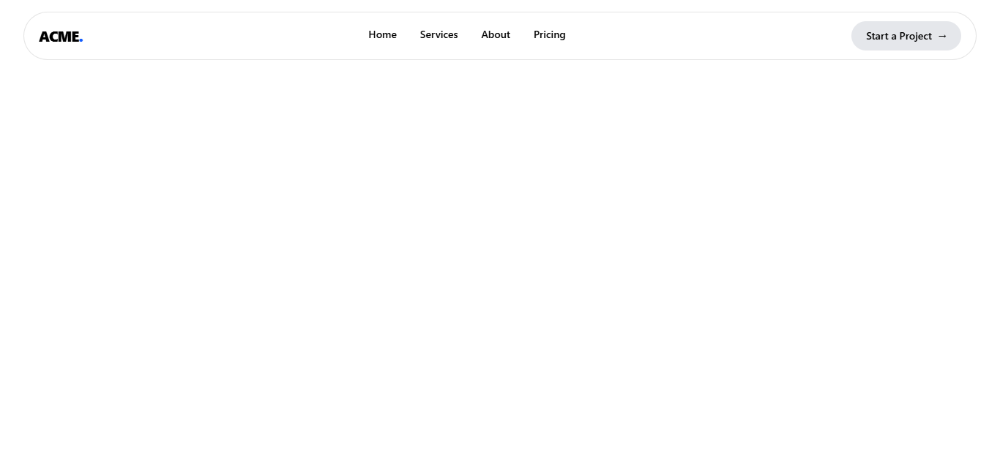
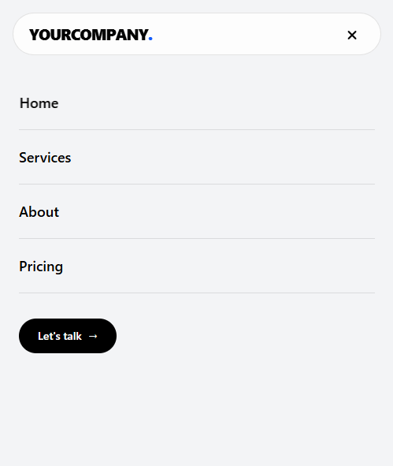

# Modern React Header

A modern, responsive website header built with React, React Router, and Tailwind CSS.

The project focuses on creating a clean and reusable navigation component with subtle animations, responsive behavior, and a modern UI suitable for company websites, SaaS products, portfolios, and landing pages.

## 🚀 Live Demo

[View Live Demo](https://modern-react-header.vercel.app/)

## 📸 Preview

### Desktop

### Mobile

---

## ✨ Features

- Modern and minimal header design
- Fully responsive layout
- Desktop and mobile navigation
- React Router integration
- Animated navigation links
- Magnetic CTA button interaction
- Animated CTA hover effect
- Mobile menu using React Portal
- Configurable logo
- Configurable CTA text
- Reusable navigation items
- Smooth CSS transitions
- Tailwind CSS styling
- Lightweight React component
- Built with Vite

---

## 🛠️ Technologies

- React
- React Router
- Tailwind CSS
- Vite
- JavaScript

---

## 📂 Project Structure

modern-react-header/
├── public/
├── src/
│   ├── components/
│   │   ├── Header.jsx
│   │   └── MobileNav.jsx
│   ├── App.jsx
│   ├── main.jsx
│   └── index.css
├── screenshots/
│   ├── desktop.png
│   └── mobile.png
├── .gitignore
├── eslint.config.js
├── index.html
├── package.json
├── package-lock.json
├── README.md
└── vite.config.js

---

## ⚙️ Installation

### Clone the repository

    git clone https://github.com/ashkangl/modern-react-header.git

### Navigate to the project

    cd modern-react-header

### Install dependencies

    npm install

### Start the development server

    npm run dev

The application will be available at:

    http://localhost:5173

---

## 💻 Usage

Import the Header component:

    import Header from "./components/Header";

    function App() {
        return (
            <>
                <Header />
                {/* Your page content */}
            </>
        );
    }

    export default App;

The header uses React Router for navigation, so make sure your application is wrapped with a router.

---

## 🎨 Customization

### Logo

    <Header logo="ACME" />

### CTA Text

    <Header ctaText="Start a Project" />

### Combined

    <Header
        logo="ACME"
        ctaText="Start a Project"
    />

---

## 🧭 Navigation

Navigation items are defined using an array:

    const navItems = [
        { path: "/", label: "Home" },
        { path: "/services", label: "Services" },
        { path: "/about", label: "About" },
        { path: "/pricing", label: "Pricing" },
    ];

You can customize them for your own website:

    const navItems = [
        { path: "/", label: "Home" },
        { path: "/work", label: "Work" },
        { path: "/blog", label: "Blog" },
        { path: "/contact", label: "Contact" },
    ];

---

## 📱 Responsive Design

### Desktop

- Company logo
- Navigation links
- Animated navigation hover effect
- CTA button
- Magnetic cursor interaction

### Mobile

- Company logo
- Mobile menu button
- Full-screen navigation
- Navigation links
- CTA button
- Close menu functionality

The mobile navigation is rendered using React Portal.

---

## ✨ Animations & Interactions

### Navigation Animation

Navigation items use a vertical text transition when hovered.

The first label moves upward while a second copy is revealed, creating a simple flip-style effect.

### Magnetic CTA

The CTA button subtly follows the user's cursor while hovering.

### CTA Hover

The CTA includes a smooth background color transition and arrow movement on hover.

---

## 🏗️ Production Build

Create an optimized production build:

    npm run build

The production files will be generated in:

    dist/

Preview the production build:

    npm run preview

---

## 🚀 Deployment

This project can be deployed using:

- Vercel
- Netlify
- GitHub Pages

### Vercel

Connect the GitHub repository to Vercel.

Recommended settings:

    Build Command: npm run build
    Output Directory: dist

Vercel can automatically detect the Vite project.

---

## 🎯 Use Cases

This header can be used for:

- Company websites
- SaaS websites
- Startup websites
- Landing pages
- Portfolio websites
- Agency websites
- Product websites
- Creative websites
- Business websites

---

## 🔧 Requirements

- Node.js 18+
- npm

Check Node.js:

    node -v

Check npm:

    npm -v

---

## 📦 Available Scripts

### Development

    npm run dev

Starts the development server.

### Production Build

    npm run build

Creates the production build.

### Preview

    npm run preview

Previews the production build locally.

### Lint

    npm run lint

Runs ESLint.

---

## 🔮 Future Improvements

Possible future improvements:

- Animated mobile menu opening and closing
- Active navigation indicator
- Dark mode
- Customizable colors
- Custom logo component
- More CTA customization
- TypeScript support
- Additional animation presets
- Improved accessibility

---

## 🤝 Contributing

Contributions and suggestions are welcome.

### 1. Fork the repository

Create a fork and clone it locally.

### 2. Create a branch

    git checkout -b feature/my-feature

### 3. Make your changes

Implement and test your changes.

### 4. Commit

    git add .
    git commit -m "Add new feature"

### 5. Push

    git push origin feature/my-feature

Then open a Pull Request.

---

## 📄 License

This project is available under the MIT License.

You are free to use, modify, and distribute this project for personal or commercial purposes.

---

## 👨‍💻 Author

**Ashkan Golzad**

Frontend Developer focused on building modern web applications and interactive user interfaces.

🌐 [Website](https://ashkangolzad.ir)

💻 [GitHub](https://github.com/ashkangl)

---

## ⭐ Support

If you find this project useful, consider giving it a ⭐ on GitHub.